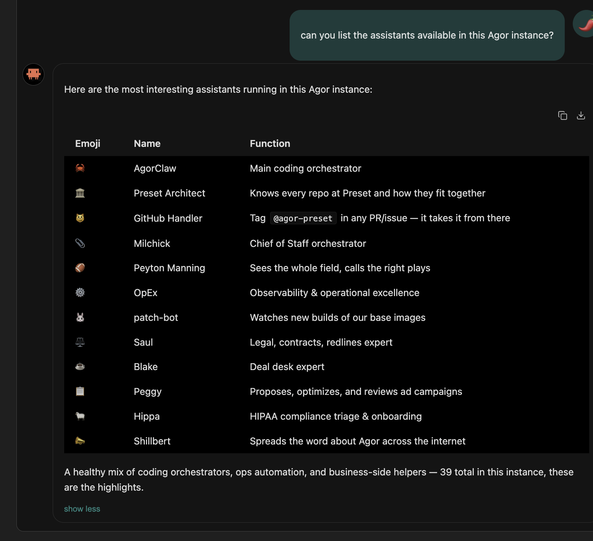
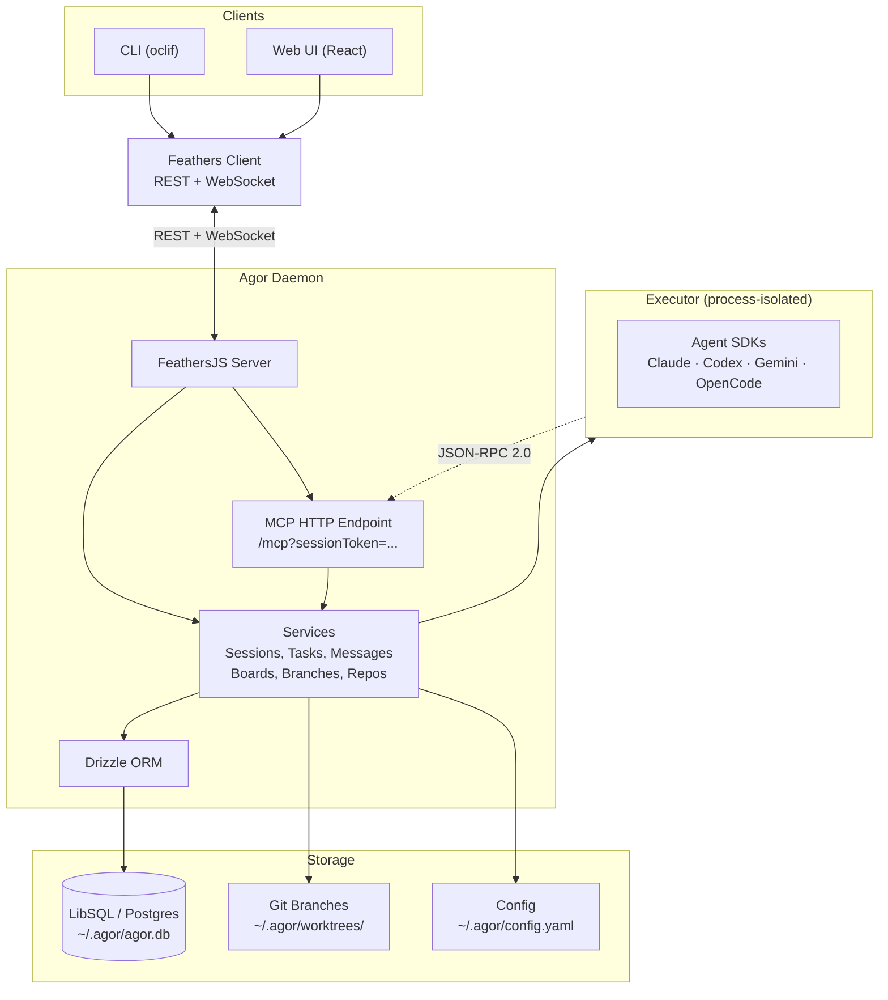

# Agor

**Team command center for all things agentic.**

Agor is a self-hosted, multiplayer-ready web workspace for running coding agents — Claude Code,
Codex, Gemini, and others — on isolated git branches. Each branch is a first-class git working
directory with its own dev environment and conversation history. Agents run in the browser instead
of a terminal, with per-prompt token and cost accounting, structured tool output, and an MCP
endpoint agents can drive themselves. Run it solo in a few minutes; turn on multiplayer and
Unix-level isolation when you bring your team.

[](https://www.npmjs.com/package/agor-live)
[](LICENSE)
[](https://agor.live/guide/getting-started)
[](https://discord.gg/Qh4TrFQZpd)

**[Documentation](https://agor.live/) · [Quick Start](#quick-start) · [Architecture](#architecture) · [Contributing](#development)**

---

## Built on the agent CLIs & SDKs you already use

Agor ships no model of its own. It drives the coding-agent CLIs and SDKs you already run,
interchangeable per session — bring your own provider and subscription, no vendor lock-in.
[Compare the harnesses →](https://agor.live/guide/sdk-comparison)

<p align="center">
  <a href="https://github.com/anthropics/claude-code"></a>
  &nbsp;&nbsp;
  <a href="https://github.com/openai/codex"></a>
  &nbsp;&nbsp;
  <a href="https://github.com/google-gemini/gemini-cli"></a>
  &nbsp;&nbsp;
  <a href="https://github.com/features/copilot"></a>
  &nbsp;&nbsp;
  <a href="https://github.com/sst/opencode"></a>
  &nbsp;&nbsp;
  <a href="https://cursor.com"></a>
</p>

<!--
  HERO VIDEO PLACEHOLDER
  A ~1-minute product tour is in production. When the asset lands, embed/link it here, e.g.:
  [](https://www.youtube.com/watch?v=VIDEO_ID)
  Until then, the unscripted demo below stands in.
-->


_The board: branches as cards, zones as regions, agent sessions, and — optionally — teammates present live._

**▶ [Watch the unscripted demo on YouTube](https://www.youtube.com/watch?v=3in0qh7ZH0g)** (13 min)

---

## What it does

- **Branches as the anchor** — every piece of work is a git branch with its own working directory,
  dev environment, conversation history, and PR. One entity to point at.
- **Isolated dev environments** — a one-click dev server per branch, with ports auto-assigned so
  parallel branches never collide.
- **Multi-runtime** — Claude Code, Codex, Gemini, OpenCode, Copilot, and Cursor (beta) are
  interchangeable per session. Bring your own provider; no vendor lock-in.
- **Rich session UI** — per-prompt token and dollar accounting, structured tool blocks,
  model/effort selectors, completion chimes. The terminal experience, in the browser.
- **MCP-native** — Agor exposes itself over MCP; sessions are auto-issued a token, so agents fork,
  spawn, schedule, and report on their own work.
- **Long-lived AI teammates** — persistent coworkers, each with a Knowledge-base namespace for
  durable, searchable memory, plus skills and schedules. They collaborate with the team and with
  each other, beyond one-off sessions.
- **Multiplayer when you want it** — live cursors, comments, and shared sessions/environments for
  your team. Optional; works fine solo.
- **Governance & observability** — branch-scoped RBAC and ACLs, per-user credentials and env
  vars, and per-prompt token + dollar accounting with full, durable history across every session.
- **Self-hosted, with real isolation** — your repos, your DB (LibSQL or Postgres), and progressive
  Unix isolation modes (`simple` → `insulated` → `strict`). BSL 1.1.

---

## Quick Start

Requires **Node.js ≥ 22.12** ([install](https://nodejs.org)).

```bash
npm install -g agor-live

agor init           # creates ~/.agor/ and the database
agor daemon start   # runs the daemon in the background
agor open           # opens the web UI
```

That's it — add a repo and create your first session from the onboarding wizard.

Prefer Homebrew? See the [Getting Started guide](https://agor.live/guide/getting-started) for the
brew path. For Docker, source builds, Postgres, and team setups, see
[Extended Installation](https://agor.live/guide/extended-install).

---

## Core Concepts

Agor is built on three foundational entities — everything else builds on these:

- **[Branches](https://agor.live/guide/branches)** — the unit of work. A first-class git working
  directory on its own branch, with an isolated dev environment and its own conversations.
  Conventionally 1 branch = 1 feature/PR.
- **[Sessions & Trees](https://agor.live/guide/sessions)** — agent conversations with genealogy.
  **Fork** to explore alternatives (copies context), **spawn** subsessions for focused subtasks
  (fresh context window).
- **[Boards & Zones](https://agor.live/guide/boards)** — a Figma-like 2D canvas of branches. Drop
  a branch into a zone to fire a templated prompt.

**[Read the Features Overview →](https://agor.live/guide/features-overview)**

---

## Key Capabilities

|                                                                           |                                                                                                                                                                                                                                                                                      |
| ------------------------------------------------------------------------- | ------------------------------------------------------------------------------------------------------------------------------------------------------------------------------------------------------------------------------------------------------------------------------------ |
| **[Teammates](https://agor.live/guide/teammates)**                        | Long-lived AI coworkers, each with its own Knowledge-base namespace for durable, semantically searchable memory — shared with the team and able to collaborate with other teammates. Taught conversationally, then equipped with skills, MCP tools, gateway channels, and schedules. |
| **[Agor MCP Server](https://agor.live/guide/internal-mcp)**               | Agor exposes itself over MCP. Agents introspect sessions, branches, and boards, and drive the system themselves.                                                                                                                                                                     |
| **[Multiplayer & Social](https://agor.live/guide/multiplayer-social)**    | Live cursors, facepiles, spatial comments, and a shared multiplayer terminal.                                                                                                                                                                                                        |
| **[Rich Chat UX](https://agor.live/guide/rich-chat-ux)**                  | Per-prompt token + dollar accounting, model/effort selectors, structured tool blocks, completion chimes.                                                                                                                                                                             |
| **[Environments](https://agor.live/guide/environment-configuration)**     | One-click dev servers per branch with auto-managed unique ports — no more port fights.                                                                                                                                                                                               |
| **[Security & RBAC](https://agor.live/guide/multiplayer-unix-isolation)** | Branch-scoped permission tiers (ACLs), per-user credentials and env vars, and progressive Unix isolation (`simple` / `insulated` / `strict`).                                                                                                                                        |
| **[Knowledge](https://agor.live/guide/knowledge)**                        | A shared, searchable markdown knowledge base — one place for decisions, runbooks, prompts, and agent memory.                                                                                                                                                                         |
| **[Scheduler](https://agor.live/guide/scheduler)**                        | Cron-style triggers for templated prompts. Powers teammate heartbeats, standups, and automated audits.                                                                                                                                                                               |
| **[Message Gateway](https://agor.live/guide/message-gateway)**            | Slack and GitHub as portals into Agor sessions.                                                                                                                                                                                                                                      |
| **[Artifacts](https://agor.live/guide/artifacts)**                        | Live, interactive apps (dashboards, mockups, tools) rendered directly on the board.                                                                                                                                                                                                  |
| **[Cards](https://agor.live/guide/cards)** (Beta)                         | Generic workflow entities for non-code workflows.                                                                                                                                                                                                                                    |

---

## Screenshots

<div align="center">
  <table>
    <tr>
      <td width="50%">
        
        <p align="center"><em>Real-time multiplayer — cursors, facepile, scoped comments</em></p>
      </td>
      <td width="50%">
        
        <p align="center"><em>Rich agent sessions with structured tool blocks</em></p>
      </td>
    </tr>
    <tr>
      <td width="50%">
        
        <p align="center"><em>Persistent AI teammates with memory and skills</em></p>
      </td>
      <td width="50%">
        
        <p align="center"><em>MCP-native — agents drive Agor themselves</em></p>
      </td>
    </tr>
    <tr>
      <td width="50%">
        
        <p align="center"><em>Scheduler — cron-style triggers for templated prompts</em></p>
      </td>
      <td width="50%">
        
        <p align="center"><em>One-click dev environments per branch</em></p>
      </td>
    </tr>
  </table>
</div>

---

## Architecture



The **daemon** (`apps/agor-daemon`, FeathersJS) owns the database, services, WebSocket events, and
the MCP HTTP endpoint. The **executor** (`packages/executor`) is a process-isolated runtime that
spawns agents via their SDKs and can run as a separate Unix user. Shared types, the Drizzle schema,
and git utilities live in `@agor/core` (`packages/core`).

**[Full Architecture Guide →](https://agor.live/guide/architecture)**

### Repository layout

```
agor/
├── apps/
│   ├── agor-daemon/   # FeathersJS backend (REST + WebSocket + MCP)
│   ├── agor-ui/       # React UI (Ant Design + React Flow)
│   ├── agor-cli/      # oclif CLI
│   └── agor-docs/     # Docs site (Nextra) — canonical reference, published at agor.live
├── packages/
│   ├── core/          # @agor/core — types, db (Drizzle), git, api
│   └── executor/      # Process-isolated agent runtime
└── context/           # Agent-oriented cheat sheets and design docs
```

---

## Development

The fastest path to a running dev instance from source:

```bash
git clone https://github.com/preset-io/agor
cd agor
docker compose up
# Visit http://localhost:5173 → login: admin@agor.live / admin
```

Prefer running locally without Docker? The two-process workflow (daemon in watch mode + UI dev
server) and the `.agor.yml` variants (sqlite / postgres / full / docs) are documented in the
[Development Guide](https://agor.live/guide/development). It also covers running Agor _inside_ Agor
for dogfooding.

See **[CONTRIBUTING.md](CONTRIBUTING.md)** for the contribution workflow, and **[CLAUDE.md](CLAUDE.md)**
for the agent-oriented map of the codebase.

---

<div align="center">

### ✨ Pledge ✨

**⭐️ I pledge to fix a GitHub issue for every star Agor gets :)**

</div>

---

## Community

- **[Discord](https://discord.gg/Qh4TrFQZpd)** — support and discussion
- **[GitHub Discussions](https://github.com/preset-io/agor/discussions)** — questions and ideas
- **[GitHub Issues](https://github.com/preset-io/agor/issues)** — bugs and feature requests

## License

[Business Source License 1.1](LICENSE).

## About

**Heavily prompted by [@mistercrunch](https://github.com/mistercrunch)** ([Preset](https://preset.io),
[Apache Superset](https://github.com/apache/superset), [Apache Airflow](https://github.com/apache/airflow)),
built by an army of Claudes and Codexes.

**Read more:** [Agor Cloud — opening a private beta](https://agor.live/blog/agor-cloud) ·
[Agent Modeling 101](https://agor.live/blog/agent-modeling-101) ·
[Raise a team helper agent in an afternoon](https://agor.live/blog/raise-team-helper-agent) ·
[all posts →](https://agor.live/blog)
